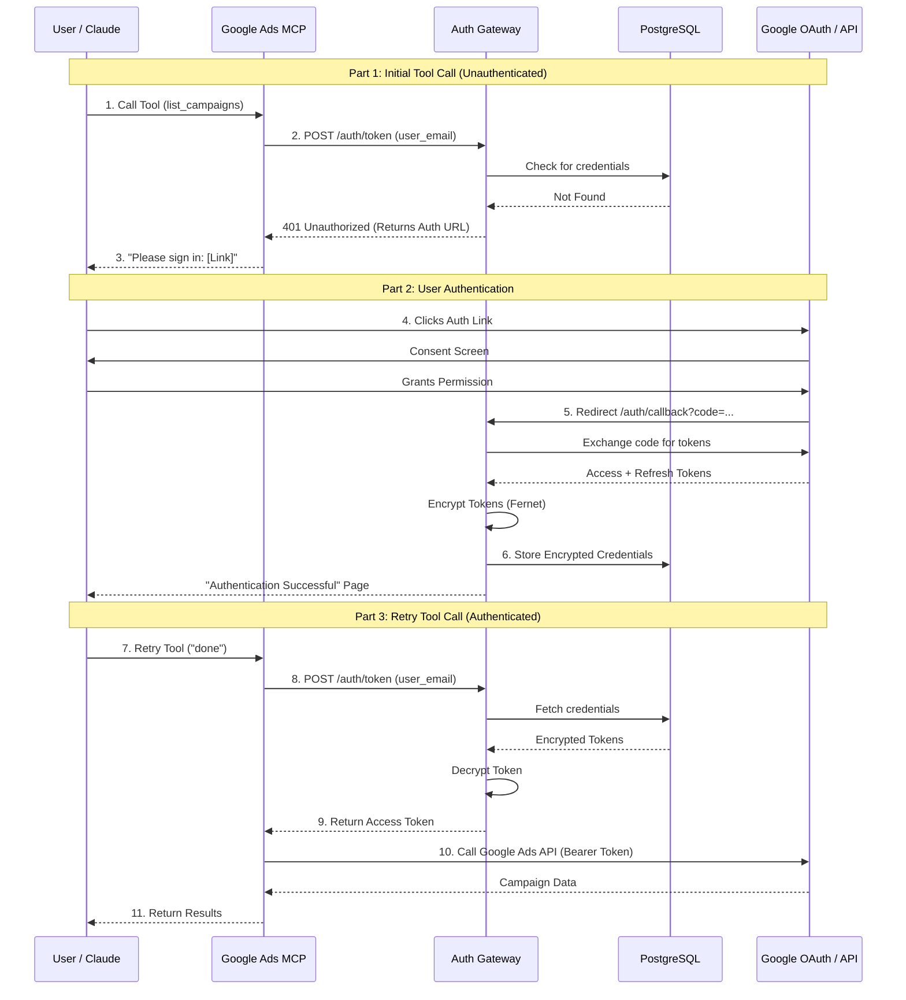

# Centralized OAuth Gateway Architecture

## 1. Project Overview (What)

The **Centralized OAuth Gateway** is a dedicated microservice designed to handle OAuth 2.0 authentication for multiple Model Context Protocol (MCP) servers.

Instead of each MCP server (Google Ads, Google Analytics, etc.) implementing its own OAuth flow, storing its own tokens, and managing its own secrets, they delegate all authentication responsibilities to this central gateway.

### Key Features
*   **Centralized Token Management**: One secure vault for all OAuth tokens.
*   **Unified Auth Flow**: A single "Sign in with Google" experience for the user.
*   **Zero-Trust MCP Servers**: MCP servers never see or store client secrets; they only request tokens using an API key.
*   **Encryption at Rest**: All tokens are encrypted using Fernet (AES-128) with support for key rotation.
*   **Stateless Operation**: Uses a PostgreSQL database for state and token storage, allowing the gateway to be stateless and scalable.

## 2. Problem Statement (Why)

### The Problem: Fragmentation
In a multi-server MCP architecture, handling authentication locally in each server leads to:
*   **Code Duplication**: Every server implements the same OAuth logic (init flow, callback handling, token refresh).
*   **Security Risks**: Client secrets are scattered across multiple [.env](file:///c:/Users/lmn21/Downloads/MCP%20Test/centralized-oauth-gateway/.env) files. Tokens are often stored in plain text JSON files locally.
*   **User Friction**: Users must authenticate separately for every single tool they use.
*   **Maintenance Nightmare**: Rotating keys or updating OAuth scopes requires updating every single server.

### The Solution: Centralization
By offloading authentication to a dedicated gateway:
*   **Security is Hardened**: Secrets are kept in one place. Tokens are encrypted.
*   **Development is Faster**: New MCP servers can be added with just a few lines of code using the `mcp-auth-client` library.
*   **User Experience is Better**: Authenticate once, use everywhere.

## 3. System Architecture (Where & How)

The system consists of three main tiers:

1.  **The Auth Gateway**: The core service managing auth flows and database.
2.  **The Shared Helper**: `mcp-auth-client` library used by MCP servers.
3.  **The MCP Servers**: The actual tools (Google Ads, Google Analytics) that consume the APIs.

### Architecture Diagram

## 4. Component Deep Dive

### A. Auth Gateway (`auth-gateway/`)
*   **Framework**: FastAPI (Python)
*   **Database**: PostgreSQL 15 (Async SQLAlchemy)
*   **Encryption**: `cryptography` library (Fernet symmetric encryption)
*   **Responsibilities**:
    *   `POST /auth/init`: Generates OAuth URLs and tracks session state.
    *   `GET /auth/callback`: Handles the redirect from Google, exchanges code for tokens, encrypts them, and stores them in Postgres.
    *   `POST /auth/token`: decrypts and returns valid access tokens to MCP servers (auto-refreshes if needed).
    *   `DELETE /auth/revoke`: Removes credentials.

### B. MCP Auth Client (`mcp-auth-client/`)
A lightweight Python package installed by MCP servers.
*   **Key Class**: [AuthClient](file:///c:/Users/lmn21/Downloads/MCP%20Test/centralized-oauth-gateway/mcp-auth-client/mcp_auth_client/client.py#39-258)
*   **Key Decorator**: `@require_auth(client, provider="google")`
*   **Function**: Hides the complexity of HTTP calls to the gateway. It handles the 401 "Auth Required" loop transparently.

### C. MCP Servers
*   **Google Ads MCP**: Uses [google_ads_server_centralized.py](file:///c:/Users/lmn21/Downloads/MCP%20Test/centralized-oauth-gateway/google-ads-mcp-oauth-main/google-ads-mcp-oauth-main/google_ads_server_centralized.py).
*   **Google Analytics MCP**: Uses [server_centralized.py](file:///c:/Users/lmn21/Downloads/MCP%20Test/centralized-oauth-gateway/google-ads-mcp-oauth-main/google-ads-mcp-oauth-main/google_ads_server_centralized.py).
*   **Implementation**: They simply instantiate [AuthClient](file:///c:/Users/lmn21/Downloads/MCP%20Test/centralized-oauth-gateway/mcp-auth-client/mcp_auth_client/client.py#39-258) and request a token. They do **not** handle client secrets or refresh tokens.

## 5. Technology Stack

### Core Infrastructure
*   **Containerization**: Docker & Docker Compose
*   **Orchestration**: Docker Compose (Network: `mcp-internal`)

### Backend (Auth Gateway)
*   **Language**: Python 3.11+
*   **Web Framework**: FastAPI
*   **Server**: Uvicorn
*   **ORM**: SQLAlchemy (Async via `asyncpg`)
*   **Database**: PostgreSQL 15
*   **Security**: Pydantic (Validation), Cryptography (Encryption)

### Client Libraries
*   **HTTP Client**: `httpx` (Async)
*   **MCP Framework**: `fastmcp` (for MCP servers)

## 6. Security Architecture

### Data Protection
*   **Tokens**: Access and Refresh tokens are **never** stored in plain text. They are encrypted using Fernet (AES-128-CBC + HMAC-SHA256).
*   **Secrets**: `GOOGLE_CLIENT_SECRET` is stored only in the Gateway's environment variables.
*   **Communication**: Communication between MCP servers and Gateway happens over a private Docker credential network (`mcp-internal`).

### Access Control
*   **API Key**: The Gateway is protected by an `X-API-Key`. Only MCP servers with the correct key can request tokens.
*   **User Isolation**: Tokens are scoped to `user_email`. One user cannot access another user's tokens.

### Key Rotation
The system supports zero-downtime key rotation:
1.  Add new key to `AUTH_GATEWAY_ENCRYPTION_KEY`.
2.  Move old key to `AUTH_GATEWAY_ROTATION_KEYS`.
3.  The system can decrypt with old keys but encrypts new data with the new key.
4.  Run `reencrypt_tokens.py` to migrate all data to the new key.

## 7. Deployment & Usage

### Prerequisites
*   Docker Desktop installed.
*   Google Cloud Project with OAuth 2.0 Credentials (Web Application).

### Setup
1.  **Configure**: Copy [.env.example](file:///c:/Users/lmn21/Downloads/MCP%20Test/centralized-oauth-gateway/.env.example) to [.env](file:///c:/Users/lmn21/Downloads/MCP%20Test/centralized-oauth-gateway/.env) and fill in Google Credentials.
2.  **Generate Keys**: Run `python auth-gateway/scripts/generate_keys.py`.
3.  **Run**: `docker-compose up -d` starts the Gateway and Database.
4.  **Run Servers**: Start MCP servers (they will connect to the Gateway).

### Typical Flow
1.  **User** asks Claude: "List my Google Ads campaigns".
2.  **Claude** calls `list_campaigns` tool on MCP server.
3.  **MCP Server** asks Gateway for a token for `user@email.com`.
4.  **Gateway** sees no token, returns 401 with an Auth URL.
5.  **MCP Server** returns the URL to Claude.
6.  **User** clicks the link, authenticates with Google.
7.  **Google** redirects to Gateway (`/auth/callback`).
8.  **Gateway** stores the encrypted token.
9.  **User** tells Claude "I'm done".
10. **Claude** retries the tool.
11. **Gateway** returns the valid token.
12. **MCP Server** fetches data from Google Ads API.
